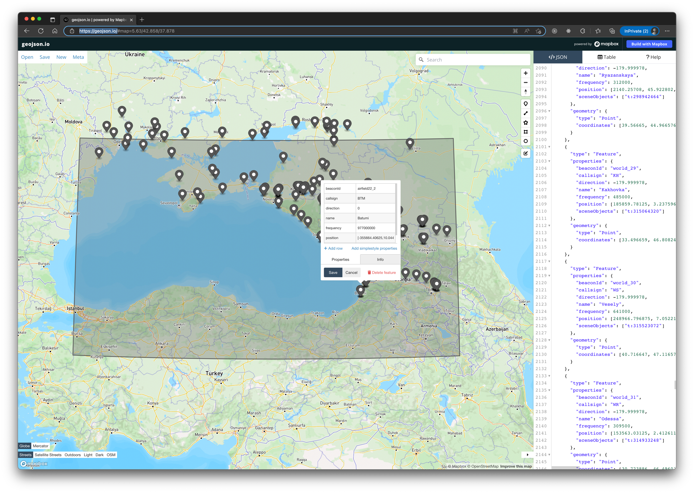

# DCS Global Index Database

> HELP WANTED!! ⚠️
>
> I really need your help to build up this database. I hope it can serve as a data foundation for all sorts of
> external applications, mission editors and in my case for a web based dynamic campaign engine.
>
> If you have any data about DCS or want to help please reach out.

DCS GTD is a database of all data exported from DCS, its core focus is producing re-usable geojson files

So you can do cool stuff like this

> NOTE:  
> This is a WIP and contributes are welcomed and encouraged.

The Database consists of GeoJSON files, geojson is the international medium of exchange for Geographic data.

It can also be very powerful when combined with GeoJSON analysis tools such as https://turfjs.org/

GeoJSON can be visualized at https://geojson.io/#map=2/0/20

Geographic Boundaries for country administration areas can be downloaded from https://www.geoboundaries.org/

## Usage

Simply import the geojson file for the terrain of interest and start unpacking the feature collection.

To take a peek at what's going on here just copy and paste the contents of a file from the terrains/...json folder and paste it into https://geojson.io/#map=2/0/20

Or even browse to the file in GitHub, and it previews it ❤️

## Contributing

Contributions are most welcome to this project, the goal is to get a global database of DCS information for use
in external mission editors and so DCS data can be generated easily.

Right now this project is in a data dump phase, so any data you have feel free to either add it as a geojson feature,
and we can refine the nomenclature in the PR or just submit an issue with the data and a maintainer can get into the right format.

To contribute directly, update the `src/terrain/feature-type.json` files building them out as per the schemas.

Once done run build, and it will validate the changes.

If you need to include a new file update the `.gtdrc.yml` config.

## Feature API

All features have a properties object, these are validated during the build phase to ensure correctness.

The type field denotes what kind of feature it is, TERRAIN, AERODROME, BEACON etc

The contracts are zod schemas, but these will be extracted out as docs soon.

See `scripts/schemas.js`
